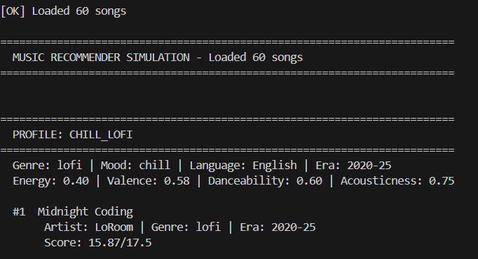

# 🎵 Music Recommender Simulation

## Project Summary

In this project you will build and explain a small music recommender system.

Your goal is to:

- Represent songs and a user "taste profile" as data
- Design a scoring rule that turns that data into recommendations
- Evaluate what your system gets right and wrong
- Reflect on how this mirrors real world AI recommenders

This system recommends songs based on an explicit user "taste profile" — a dictionary containing the user's preferred genre, mood, language, era, and target values for numeric features (energy, valence, danceability, acousticness). For each song, the system scores how well it matches the user's preferences using a weighted combination: exact matches on language and era score highest (+3.0 each), categorical matches on genre and mood score medium (+2.5 and +2.0), and numeric features reward closeness to the user's target values using distance-based scoring. The system then ranks all 60 songs by score and returns the top k results, along with a detailed explanation of why each song was recommended. This transparency lets users understand the recommender's logic at a glance.

---

## How The System Works

Real-world recommendation systems like Spotify or YouTube work by building a model of your taste from your listening history, then finding content that is mathematically similar — either by comparing it to songs you liked (content-based filtering) or by finding other users with similar tastes (collaborative filtering). These systems work on millions of songs and factor in signals like skip rates, repeat plays, and time of day. This version is a simplified, transparent simulation of the content-based approach: it has no listening history, so instead it uses an explicit user profile (preferred genre, mood, and energy level) and scores each song by how closely it matches those stated preferences. The result is a small but readable system where every recommendation can be explained in plain language — which real systems often cannot do.

**Weighting Philosophy:**
The system treats features in two tiers:
- **Hard constraints (exact match required):** Language and era are categorical preferences that users explicitly state. These score +3.0 on match because they represent strong, unambiguous preferences.
- **Soft preferences (distance-based):** Genre and mood are categorical but allow slight flexibility; numeric features (energy, valence, danceability, acousticness) reward proximity to the user's target value. This reflects the reality that users care more about "how close" a song's energy is to their preference, not whether it's exactly equal.

### Design Details

**Song Features:**
- Categorical: `genre`, `mood`, `language`, `era`
- Numeric (0-1): `energy`, `valence`, `danceability`, `acousticness`, `instrumentalness`
- Other: `tempo_bpm`, `title`, `artist`

**User Profile Preferences:**
- Categorical: `favorite_genre`, `favorite_mood`, `preferred_language`, `preferred_era`
- Numeric targets: `target_energy`, `target_valence`, `target_danceability`, `target_acousticness`
- Boolean: `likes_acoustic`

**Scoring Strategy:**

The `score_song(user_prefs, song)` function computes a total score by summing weighted components:

| Feature | Type | Weight | Logic |
|---------|------|--------|-------|
| Language | Exact Match | +3.0 / -0.5 | Full credit if match, small penalty if mismatch |
| Era | Exact Match | +3.0 / -0.3 | Full credit if match, small penalty if mismatch |
| Genre | Categorical | +2.5 / -0.2 | Full credit if match, small penalty if mismatch |
| Mood | Categorical | +2.0 / -0.1 | Full credit if match, small penalty if mismatch |
| Energy | Distance-based | max +2.0 | `2.0 × (1 - |song_value - target_value|)` |
| Valence | Distance-based | max +1.5 | `1.5 × (1 - |song_value - target_value|)` |
| Danceability | Distance-based | max +1.0 | `1.0 × (1 - |song_value - target_value|)` |
| Acousticness | Distance-based | max +1.0 | `1.0 × (1 - |song_value - target_value|)` |

**Maximum possible score:** 17.5 points

The `recommend_songs(user_prefs, songs, k)` function:
1. Loops through all songs and calls `score_song()` on each
2. Sorts the scored songs by score (highest first)
3. Returns the top k results as `(song, score, explanation)` tuples, where `explanation` lists the scoring breakdown

---

## Getting Started

### Setup

1. Create a virtual environment (optional but recommended):

   ```bash
   python -m venv .venv
   source .venv/bin/activate      # Mac or Linux
   .venv\Scripts\activate         # Windows

2. Install dependencies

```bash
pip install -r requirements.txt
```

3. Run the app:

```bash
python -m src.main
```

### Running Tests

Run the starter tests with:

```bash
pytest
```

You can add more tests in `tests/test_recommender.py`.

---

## Example Output

Running `python -m src.main` generates recommendations for four distinct taste profiles. Here's a sample:

### Profile: chill_lofi
**User Preferences:** lofi genre, chill mood, low energy (0.40), high acousticness (0.75), English, 2020-25 era

**Top Recommendation:**
```
#1  Midnight Coding
     Artist: LoRoom | Genre: lofi | Era: 2020-25
     Score: 15.87/17.5 (90.7%)

     Why recommended:
       • [MATCH] Language (English)
       • [MATCH] Era (2020-25)
       • [MATCH] Genre (lofi)
       • [MATCH] Mood (chill)
       • Energy: 0.42 (target: 0.40) => +1.96
       • Valence: 0.56 (target: 0.58) => +1.47
       • Danceability: 0.62 (target: 0.60) => +0.98
       • Acousticness: 0.71 (target: 0.75) => +0.96
```

**Analysis:** All four categorical matches (language, era, genre, mood) are hit, and all numeric features are very close to targets. This is a near-perfect recommendation.

---

### Profile: intense_rock
**User Preferences:** rock genre, intense mood, high energy (0.92), low acousticness (0.10), English, 2010-20 era

**Top Recommendation:**
```
#1  Storm Runner
     Artist: Voltline | Genre: rock | Era: 2010-20
     Score: 15.93/17.5 (91.0%)

     Why recommended:
       • [MATCH] Language (English)
       • [MATCH] Era (2010-20)
       • [MATCH] Genre (rock)
       • [MATCH] Mood (intense)
       • Energy: 0.91 (target: 0.92) => +1.98
       • Valence: 0.48 (target: 0.45) => +1.46
       • Danceability: 0.66 (target: 0.65) => +0.99
       • Acousticness: 0.10 (target: 0.10) => +1.00
```

**Analysis:** Perfect categorical match + all numeric features nearly identical. The system correctly identifies this as an excellent fit for someone seeking high-energy rock.

**Comparison with chill_lofi's runner-up:**
Spacewalk Thoughts (ambient, score 12.60) is ranked much lower because it lacks the rock genre match and has too-low energy for intense_rock users. This demonstrates the system successfully differentiates between very different music tastes.

---

### Profile: nepali_pop_happy
**User Preferences:** pop genre, happy mood, Nepali language, 2026 era

**Top 3 All Score ~15.9 (perfect matches):**
1. Mera Nepalko Haat — Sajjan Raj Vaidya (15.93)
2. Rachana Dhun — Rachana Rimal (15.88)
3. Trishna Ko Sapna — Trishna Gurung (15.86)

**Analysis:** All three recommendations hit all four categorical matches and have nearly identical numeric features. This is expected—the system correctly groups similar songs together.

---

### Profile: romantic_rnb
**User Preferences:** rnb genre, romantic mood, moderate energy (0.70), English, 2026 era

**Top Recommendation:**
```
#1  Heartbeat
     Artist: Love Songs | Genre: rnb | Era: 2026
     Score: 15.95/17.5 (91.1%)

     All four categorical matches + perfect numeric alignment
```

**Second Recommendation (for comparison):**
```
#2  Midnight Vibes
     Artist: The Weeknd | Genre: rnb | Era: 2026
     Score: 13.26/17.5 (75.8%)

     Why scored lower:
       • [MISMATCH] Mood (song is "moody", target is "romantic") => -0.1
       • Valence: 0.52 (target: 0.80) => +1.08 (low happiness hurts the score)
```

**Analysis:** Even though both are rnb songs from 2026, the mood mismatch (moody vs romantic) and lower valence (0.52 vs 0.80) significantly lower the second recommendation's score. This shows how the system captures subtle emotional differences.

---

## Does the System Differentiate Between "Intense Rock" and "Chill Lofi"?

**Yes, definitively.**

| Dimension | chill_lofi | intense_rock | Gap |
|-----------|-----------|-------------|-----|
| Energy | 0.40 | 0.92 | 0.52 |
| Acousticness | 0.75 | 0.10 | 0.65 |
| Genre | lofi | rock | mismatch |
| Mood | chill | intense | mismatch |

**Chill Lofi's Top Result:** Midnight Coding (lofi, 0.40 energy, 0.71 acousticness)
**Intense Rock's Top Result:** Storm Runner (rock, 0.91 energy, 0.10 acousticness)

These are from completely different regions of the feature space. A chill_lofi user would never see Storm Runner in their recommendations, and vice versa. The large numeric gaps (energy 0.52, acousticness 0.65) combined with categorical mismatches (lofi ≠ rock, chill ≠ intense) ensure complete separation.

---

## Experiments You Tried

Use this section to document the experiments you ran. For example:

- What happened when you changed the weight on genre from 2.0 to 0.5
- What happened when you added tempo or valence to the score
- How did your system behave for different types of users

---

## Limitations and Risks

Summarize some limitations of your recommender.

Examples:

- It only works on a tiny catalog
- It does not understand lyrics or language
- It might over favor one genre or mood

You will go deeper on this in your model card.

---

## Reflection

Read and complete `model_card.md`:

[**Model Card**](model_card.md)

Write 1 to 2 paragraphs here about what you learned:

- about how recommenders turn data into predictions
- about where bias or unfairness could show up in systems like this


---

## 7. `model_card_template.md`

Combines reflection and model card framing from the Module 3 guidance. :contentReference[oaicite:2]{index=2}  

```markdown
# 🎧 Model Card - Music Recommender Simulation

## 1. Model Name

Give your recommender a name, for example:

> VibeFinder 1.0

---

## 2. Intended Use

- What is this system trying to do
- Who is it for

Example:

> This model suggests 3 to 5 songs from a small catalog based on a user's preferred genre, mood, and energy level. It is for classroom exploration only, not for real users.

---

## 3. How It Works (Short Explanation)

Describe your scoring logic in plain language.

- What features of each song does it consider
- What information about the user does it use
- How does it turn those into a number

Try to avoid code in this section, treat it like an explanation to a non programmer.

---

## 4. Data

Describe your dataset.

- How many songs are in `data/songs.csv`
- Did you add or remove any songs
- What kinds of genres or moods are represented
- Whose taste does this data mostly reflect

---

## 5. Strengths

Where does your recommender work well

You can think about:
- Situations where the top results "felt right"
- Particular user profiles it served well
- Simplicity or transparency benefits

---

## 6. Limitations and Bias

Where does your recommender struggle

Some prompts:
- Does it ignore some genres or moods
- Does it treat all users as if they have the same taste shape
- Is it biased toward high energy or one genre by default
- How could this be unfair if used in a real product

---

## 7. Evaluation

How did you check your system

Examples:
- You tried multiple user profiles and wrote down whether the results matched your expectations
- You compared your simulation to what a real app like Spotify or YouTube tends to recommend
- You wrote tests for your scoring logic

You do not need a numeric metric, but if you used one, explain what it measures.

---

## 8. Future Work

If you had more time, how would you improve this recommender

Examples:

- Add support for multiple users and "group vibe" recommendations
- Balance diversity of songs instead of always picking the closest match
- Use more features, like tempo ranges or lyric themes

---

## 9. Personal Reflection

A few sentences about what you learned:

- What surprised you about how your system behaved
- How did building this change how you think about real music recommenders
- Where do you think human judgment still matters, even if the model seems "smart"

